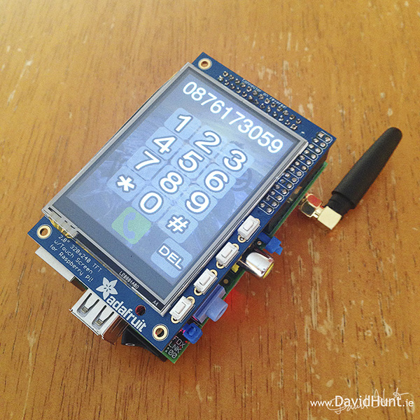

PyPhone
=======

PyPhone - Lifted from the hard work of David Hunt.
  
DIY Cellphone based on PiPhone Raspberry Pi and Adafruit PiTFT by [David Hunt](http://www.davidhunt.ie) 

Read more about this project at [Dave's Blog](http://www.davidhunt.ie/piphone-a-raspberry-pi-based-smartphone/)

Enjoy!

**Prerequisites:**

You must have gone through the [Adafruit PiTFT setup instructions](http://learn.adafruit.com/adafruit-pitft-28-inch-resistive-touchscreen-display-raspberry-pi).

**Get repo:**
    
    git clone git@github.com:gjyoung1974/PyPhone.git 
    
    
**Usage:**

    cd PyPhone

    `$ python piphone.py`

Full details at: [Dave's Blog](http://www.davidhunt.ie/piphone-a-raspberry-pi-based-smartphone/)

---
